# Nos Arc 기술 설계

## 1. 권장 배치 구성

단일 N100 16GB 서버에서 운영하는 것을 전제로 한다.

```mermaid
flowchart LR
    B[Browser] --> W[Web/API]
    W --> DB[(SQLite)]
    W --> FS[(Local media storage)]
    W --> Q[(Redis job queue)]
    Q --> IW[Ingest worker]
    Q --> OW[OCR worker]
    Q --> TW[Translation worker]
    Q --> RW[Render/index worker]
    IW --> FS
    OW --> FS
    TW --> FS
    RW --> DB
    RW --> FS
```



웹 프로세스와 작업 프로세스는 같은 애플리케이션 이미지에서 실행할 수 있다. 저장소가 한 대인 MVP에서는 SQLite와 로컬 디스크가 가장 단순하다. Redis는 작업 큐와 진행 이벤트 전달에만 사용한다. 백업 대상은 SQLite 파일과 media 디렉터리다.

## 2. 모듈 경계

- `auth`: 환경 변수 로드, 비밀번호 검증, 세션 쿠키, rate limit
- `catalog`: 작품, 태그, 화, 정렬, 검색
- `ingest`: MIME·시그니처 검사, PDF 렌더링, ZIP/RAR 안전 해제, 페이지 정규화
- `ocr`: 텍스트 영역 감지, 일본어 인식, 읽기 순서, 신뢰도 계산
- `translation`: 언어쌍별 모델 어댑터, 용어 사전, 문장 배치 처리
- `render`: 오버레이 JSON과 썸네일, 페이지 메타데이터 생성
- `jobs`: 작업 생성, 단계별 상태, 재시도, 취소, 이벤트
- `reader`: 원본 페이지와 번역 오버레이 전달

각 AI 단계는 공통 인터페이스를 사용한다. 예를 들어 OCR 모델을 교체해도 `OcrResult`의 영역 좌표·원문·신뢰도 계약은 유지한다. 번역 모델도 `TranslationResult`에 입력 ID, 출력문, 모델 버전, 용어 사전 버전을 기록한다.

## 3. AI 모델 라우팅

N100에서 품질과 메모리를 함께 관리하려면 하나의 거대한 모델로 모든 단계를 처리하지 않고 작업별 경량 모델을 분리한다.

| 작업 | 기본 후보 | 운용 원칙 |
|---|---|---|
| 텍스트 영역 감지 | PaddleOCR 모바일 계열 | 페이지 전체에서 텍스트 영역과 방향을 찾고 CPU 추론으로 제한 |
| 일본어 인식 | Manga OCR | 세로·가로 텍스트, 후리가나, 말풍선에 특화된 인식 어댑터로 사용 |
| 일반 언어 인식 | PaddleOCR 다국어 모델 | 일본어 외 입력이나 Manga OCR 실패 시 fallback |
| 일본어→한국어 번역 | Argos Translate의 설치된 언어 패키지 또는 CTranslate2로 변환한 Marian/OPUS 계열 | 직접 언어쌍을 우선하고, 없으면 명시적인 fallback만 허용 |
| 용어·이름 보정 | SQLite 기반 용어 사전 | 큰 언어 모델 호출 대신 작품별 치환·보호 토큰 사용 |
| 페이지 출력 | Pillow/SVG·Canvas 오버레이 | MVP에서 CPU 부담이 큰 인페인팅을 기본 사용하지 않음 |

Manga OCR은 일본어 만화의 세로·가로 텍스트와 후리가나 등을 대상으로 하는 전용 OCR 프로젝트다. PaddleOCR은 다국어 인식과 언어 지정이 가능하므로 감지 및 fallback 계층으로 적합하다. 번역 실행은 CTranslate2의 INT8 CPU 모드를 우선 검토한다. CTranslate2 문서상 x86-64 CPU에서 INT8과 MKL/oneDNN 백엔드를 사용할 수 있으므로 N100에서 모델 크기와 처리 시간을 줄이는 선택지로 삼는다.

번역 모델의 최종 선택은 실제 샘플로 고정한다. 일본어 만화 100페이지를 기준으로 다음을 비교한다.

- 말풍선 문장 보존율
- 고유명사·의성어 오류율
- 페이지당 평균 처리 시간
- 작업 중 최대 RSS 메모리
- 같은 문장 반복 처리 시 결과 일관성

번역 품질이 낮은 경우 자동으로 더 큰 모델을 무작정 호출하지 않는다. `translator_profile`을 `fast`, `balanced`, `quality`로 두고, N100에서는 `balanced`를 기본값으로 둔다. `quality`는 작업 대기열과 메모리 사용량을 사용자에게 보이는 설정으로 둔다.

## 4. 메모리와 동시성 정책

- AI 작업 전역 동시성 기본값은 1이다.
- OCR 모델과 번역 모델을 동시에 상주시키지 않는다. 단계가 바뀔 때 모델을 해제하거나 별도 worker 프로세스를 재사용한다.
- 이미지 페이지는 한 번에 한 장 또는 작은 배치만 메모리에 올린다.
- PDF와 압축 파일은 최대 파일 크기, 최대 페이지 수, 압축 해제 후 총 크기를 제한한다.
- 썸네일은 원본보다 작은 크기로 생성하고, 리더는 현재 페이지 주변의 제한된 수만 미리 읽는다.
- 모델 파일은 애플리케이션 이미지와 분리된 캐시에 두고 버전을 고정한다.
- `WORKER_CONCURRENCY=1`, `AI_GLOBAL_CONCURRENCY=1`을 기본값으로 제공한다.

초기 목표값은 측정 전 가정으로 기록한다. 한 화 50페이지를 장시간 처리할 수 있고, 웹 요청이 작업 처리 때문에 멈추지 않으며, 작업 중 전체 서비스가 16GB 메모리 안에서 안정적으로 유지되는 것이 우선이다. 실제 페이지당 시간과 메모리 목표는 벤치마크 후 확정한다.

## 5. 데이터 모델 초안

```text
Series
  id, title, original_title, description, cover_asset_id
  target_language, status, created_at, updated_at

Tag
  id, name, slug

SeriesTag
  series_id, tag_id

Chapter
  id, series_id, number_label, sort_key, title
  source_asset_id, page_count, processing_status
  created_at, updated_at

Page
  id, chapter_id, page_index, image_asset_id, width, height

OcrBlock
  id, page_id, polygon_json, source_text, confidence
  reading_order, model_id, model_version

Translation
  id, ocr_block_id, source_language, target_language
  translated_text, translator_id, translator_version, glossary_version

Job
  id, chapter_id, type, status, current_stage
  progress, retry_count, error_code, error_message
  input_hash, created_at, started_at, finished_at

Asset
  id, storage_key, mime_type, byte_size, sha256, kind, created_at
```

파일 이름이나 사용자가 입력한 제목을 경로로 직접 사용하지 않는다. 모든 저장 키는 내부 ID와 무작위 토큰으로 만든다.

## 6. API 초안

| 메서드 | 경로 | 목적 |
|---|---|---|
| `POST` | `/auth/login` | 공유 비밀번호 검증과 세션 발급 |
| `POST` | `/auth/logout` | 세션 폐기 |
| `GET` | `/api/series` | 작품 목록, 태그 필터, 검색 |
| `POST` | `/api/series` | 작품 생성 |
| `POST` | `/api/series/{id}/chapters` | 화와 파일 등록, `202 Accepted` 반환 |
| `GET` | `/api/chapters/{id}` | 화 상세와 페이지·번역 상태 |
| `GET` | `/api/jobs/{id}` | 작업 상태 조회 |
| `POST` | `/api/jobs/{id}/retry` | 실패 단계부터 재시도 |
| `POST` | `/api/jobs/{id}/cancel` | 대기 중 작업 취소 |
| `GET` | `/api/jobs/events` | SSE 또는 폴링 대체용 진행 이벤트 |
| `GET` | `/media/{asset_key}` | 세션 검증 후 원본·파생 자산 제공 |

파일 업로드 API는 multipart 스트림을 임시 파일로 받고, 크기 제한과 파일 시그니처를 검증한 뒤 최종 저장소로 이동한다. API는 파일 전체 처리 완료를 기다리지 않고 작업 ID를 응답한다.

## 7. 환경 변수 초안

```dotenv
APP_NAME=Nos Arc
APP_ENV=production
NOSARC_ACCESS_PASSWORD=
NOSARC_ACCESS_PASSWORD_HASH=
SESSION_SECRET=
DATABASE_URL=sqlite:///./data/nosarc.db
REDIS_URL=redis://redis:6379/0
MEDIA_ROOT=./data/media
MODEL_ROOT=./data/models
MAX_UPLOAD_BYTES=1073741824
MAX_PAGES_PER_CHAPTER=500
WORKER_CONCURRENCY=1
AI_GLOBAL_CONCURRENCY=1
OCR_MODEL_ID=manga-ocr
OCR_FALLBACK_MODEL_ID=paddleocr-mobile
TRANSLATOR_PROVIDER=argos
TRANSLATOR_MODEL_ID=
SOURCE_LANGUAGE=ja
TARGET_LANGUAGE=ko
```

실제 비밀번호와 세션 비밀값은 문서나 예시 파일에 넣지 않는다. 운영 로그에도 환경 변수 값과 토큰을 출력하지 않는다.

## 8. 보안 설계

- 모든 `/api`와 `/media` 요청에서 인증 세션을 확인한다.
- 세션 쿠키는 `HttpOnly`, `Secure`, `SameSite=Lax`로 설정한다.
- 로그인 실패 횟수와 업로드 요청을 제한한다.
- 업로드 파일은 경로 탐색, 심볼릭 링크, ZIP 폭탄, PDF 폭탄, 과도한 해상도를 검사한다.
- 파일명은 화면 표시용으로만 저장하고 경로에는 사용하지 않는다.
- 원본 파일과 OCR 결과를 공개 URL로 직접 노출하지 않는다.
- 오류 응답에 서버 경로, 환경 변수, 모델 내부 예외를 그대로 포함하지 않는다.
- 작품을 외부에 공개할 기능을 넣기 전, 업로드한 콘텐츠에 대한 이용 권리와 번역·보관 범위를 확인한다.

## 9. 참고한 공식 자료

- [Manga OCR](https://github.com/kha-white/manga-ocr)
- [PaddleOCR multilingual recognition](https://www.paddleocr.ai/v3.3.0/en/version3.x/algorithm/PP-OCRv5/PP-OCRv5_multi_languages.html)
- [CTranslate2 quantization](https://github.com/OpenNMT/CTranslate2/blob/master/docs/quantization.md)
- [CTranslate2 performance](https://github.com/OpenNMT/CTranslate2/blob/master/docs/performance.md)
- [Argos Translate](https://github.com/argosopentech/argos-translate)
